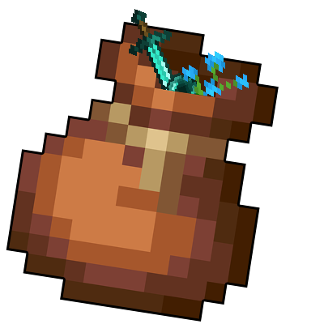
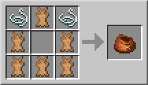

# BUNDLES!    

During Minecraft Live 2020 Mojang announced that in 1.17 a new item will be introduced to the game: the Bundle! 
This is like an early game version of the Shulker Box, allowing you to save some inventory space.

# ⚙ How to get a Bundle?
Getting a Bundle is really easy, as it doesn't require too many materials. All you need is just 5 pieces of Rabbit Hide and 2 Strings to create a Bundle!

# 🤔 How does it work?
Select the Bundle from your inventory, then right-click on a stack to put it inside the Bundle, or right click with the
stack on the Bundle to put inside if there's space available.

If you want to take out the Items from the Bundle, right click it in inventory to take out one Item from the Bundle
(from last to the first one), or right click it outside the inventory to drop all the Bundle Items on the ground.

The functionality has been ported to mimic the latest 1.17 snapshots, where Bundle were originally developed, so you
can check the [Minecraft Wiki](https://minecraft.fandom.com/wiki/Bundle) to see how a Bundle works.

Also featured in Boodlyneck's Mods of the Week serie!

# 👀 Can I put anything inside the Bundle?
No, there are certain blocks/items that you can't put inside a Bundle. 
Which blocks or items you ask? Well, you can decide them! By default, the mod comes with two tags,
**bundle\_ignored\_blocks** and **bundle\_ignored\_items**. These two tags contains all the blocks and the items that can't
be put inside a Bundle. By default, you can't put another Bundle, a Chest, a Trapped Chest, an Ender Chest and 
any Shulker Box inside a Bundle, but if you wish you can always modify those tags to allow those blocks to be
put inside the Bundle and create some black holes! Or even do the opposite and add other blocks or items
that you don't want to be put inside the Bundle. Just make sure you put the right thing in the right tag (so blocks
inside the **bundle\_ignored\_blocks** tag and items inside the **bundle\_ignored\_items** tag). The only limit is
your creativity!

# 🛍 How many items can fit inside a Bundle?
You can put up to 64 items (or a full stack) inside a Bundle, but remember that certain Items, like Tools or Ender Pearls,
will take more space than normal blocks inside a Bundle.

# 🌐 Where can I download this mod?
You can download this mod on [CurseForge](https://www.curseforge.com/minecraft/mc-mods/bundles-mod). **I will post new releases only there**. Any other websites that offers you this mod shouldn't be trusted!

# 😁 Conclusion
Minecraft 1.17 has been one of the greatest update of all time, full of many new content we asked for so long!
This mod aims to introduce the Bundle mechanic in 1.16.5, however note that all of this is based purely on 
what can be done in such version, as something is really hard or practically impossible to do (like the Tooltip for example), so there might be some aspects that may change or differ entirely 
from what is inside this mod. 
Also consider that the Bundle itself is still in development in Vanilla Minecraft, so things might actually change
in the future. If that is the case I will update the mod to match such changes.

That being said, I hope you enjoy it! Let me know if there are any issues on the [issue tracker](https://github.com/JimiIT92/BundlesMod/issues), have a nice day! 😁
